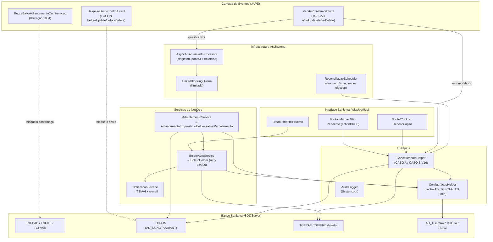
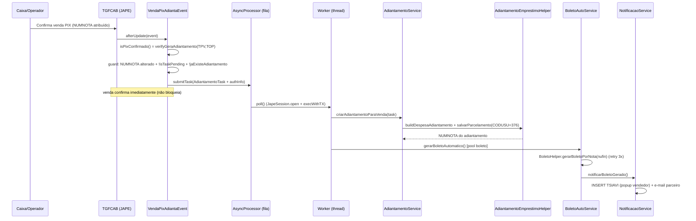

# Documentação Técnica — Módulo VendaPixAdianta

> **Cliente:** Bel Lube Distribuidor (Bellube) · **ERP:** Sankhya-OM (WildFly/JEE)
> **Pacote:** `br.com.bellube.sankhya.eventos.VendaPixAdianta`
> **Build em produção:** `2026-05-18-POLLING-DELETE-CASO-B-V16`
> **Status:** ✅ **Ativo em produção** (corroborado por logs de 2026-05-26 e 2026-06-02)
> **Documento gerado em:** 2026-06-02 · análise de código + cruzamento com `server.log_20260602174514.zip`
> **Skills aplicadas:** akita-ai-engineering · architecture-designer · sankhya-expert · lei-do-bem

---

## Sumário

1. [Visão geral](#1-visão-geral)
2. [Status em produção (evidência de runtime)](#2-status-em-produção-evidência-de-runtime)
3. [Arquitetura](#3-arquitetura)
4. [Inventário de componentes](#4-inventário-de-componentes)
5. [Fluxo de negócio end-to-end](#5-fluxo-de-negócio-end-to-end)
6. [Regras de negócio implementadas](#6-regras-de-negócio-implementadas)
7. [Integração com o core Sankhya](#7-integração-com-o-core-sankhya)
8. [Configuração e parâmetros](#8-configuração-e-parâmetros)
9. [Modelo de concorrência e transações](#9-modelo-de-concorrência-e-transações)
10. [Cruzamento com logs de produção](#10-cruzamento-com-logs-de-produção)
11. [Architecture Decision Records (ADRs)](#11-architecture-decision-records-adrs)
12. [Riscos e recomendações](#12-riscos-e-recomendações)
13. [Drift vs README original](#13-drift-vs-readme-original)
14. [Enquadramento Lei do Bem](#14-enquadramento-lei-do-bem)
15. [Glossário e referências](#15-glossário-e-referências)

---

## 1. Visão geral

O **VendaPixAdianta** é uma customização Java do ERP Sankhya-OM que **automatiza a criação de um Adiantamento/Empréstimo** (par de títulos despesa + receita em `TGFFIN`) e a **emissão automática do boleto bancário** sempre que uma **venda confirmada (`TGFCAB`) é qualificada como PIX**. O módulo também gere todo o ciclo de vida do adiantamento: cancelamento automático em estornos/abortos, reconciliação periódica de órfãos, bloqueios de baixa e confirmação, e notificação ao vendedor.

**Objetivo de negócio:** quando o caixa fatura uma venda paga via PIX, o sistema gera um adiantamento financeiro vinculado, sem intervenção manual, respeitando todas as validações nativas do ERP.

**Princípios de design (não-negociáveis):**
- **Não-bloqueante:** falha na criação do adiantamento **nunca** impede a confirmação da venda (Javadoc de `VendaPixAdiantaEvent`, linha 22).
- **Assíncrono:** o trabalho pesado roda em pool de threads dedicado, isolado da transação de faturamento.
- **Fidelidade ao core:** o adiantamento é criado via API nativa (`AdiantamentoEmprestimoHelper`), não por `INSERT` direto, garantindo que todas as regras do ERP sejam aplicadas.
- **Configurável por empresa:** parâmetros operacionais externalizados na tabela `AD_TGFCAA`.

---

## 2. Status em produção (evidência de runtime)

Cruzamento com `X:\server.log_20260602174514.zip` (372 MB compactado / 6,78 GB · 7.168 entradas). Foram stream-filtradas as entradas `server.log` (484 MB, 02/06/2026) e `server.log.2026-05-26` (777 MB) → artefato `X:\VendaPix_log_matches.txt` com **92.861 linhas** (filtro amplo — inclui entradas genéricas de “adiantamento” do core Sankhya), das quais **7.913 são deste módulo** (identificadas pelos prefixos próprios `[VENDAPIX-ASYNC]`, `[BOLETO-AUTO]`, `[ReconciliacaoScheduler]`, `[CancelamentoHelper]`, `[MarcarNaoPendente]`, `[VendaPixAdiantaEvent]`).

| Indicador | Evidência | Veredito |
|---|---|---|
| Build em execução | `*** Classloader carregou VendaPixAdiantaEvent - BUILD=2026-05-18-POLLING-DELETE-CASO-B-V16 ***` | Bate com o código-fonte (`VendaPixAdiantaEvent.java:30`) |
| Pool assíncrono ativo | `[VENDAPIX-ASYNC] Iniciando 3 workers`; `Worker-3 OK NUNOTA=4888057 em 387ms` | 3 workers confirmados; latência **139–387 ms** |
| Pool de boleto isolado | `pool-4383-*` (adiantamento) vs `pool-4382-*`/`[BOLETO-AUTO]` | Isolamento de pools confirmado |
| Reconciliação periódica | **753 ciclos** `(VendaPix-Reconciliacao)`, todos `<300ms`, “nenhum orfao detectado” | Scheduler de 5 min saudável |
| Eleição de líder | `Esta instancia (...) perdeu posse para (...) - auto-encerrando` | Anti-redeploy funcionando |
| Cancelamento CASO A | `V15 CASO A (sem boleto) - DELETE FISICO: TGFFRE=2, TFPIRB=0, TGFFIN=2` | Confirmado |
| Cancelamento CASO B | `V16 CASO B passo 1/2 - SOFT CANCEL ... Aguardando worker async ... (polling 30s)` | Confirmado |
| Filtro `AD_GERAADIANT` | **1.568** notas `"nao qualifica para fluxo PIX"` vs ~30 adiantamentos criados (janela de 3 h) | Filtro seletivo operando |
| Erros do módulo | **0** exceptions do pacote `br.com.bellube...VendaPixAdianta` no `server.log` (02/06) | Sem falhas atribuíveis ao módulo |

**Janela de atividade observada:** contínua em 26/05/2026 (00:01→23:59) e 02/06/2026 (00:00→17:46).

**Connection leaks — o módulo está EXONERADO.** Os 1.176 `connectionLeakDumps/MGEDS/dump-*` (26/02 a 13/04/2026) **não** envolvem este módulo. Os top frames apontam para:
1. `br.com.sankhya.mge.servlet.MgeServletContextListener.logVerifier` (core Sankhya, conexão de inicialização nunca fechada);
2. `br.com.bellube.fastchannel.service.LogService.logEntry` (**outro** módulo Bellube — `fastchannel`).

Nenhum frame menciona `VendaPixAdianta`.

---

## 3. Arquitetura

### 3.1. Diagrama de componentes



### 3.2. Diagrama de sequência (caminho feliz)



---

## 4. Inventário de componentes

26 arquivos Java em 7 pacotes. Camadas: **event** (gatilhos JAPE), **rules** (regra de liberação), **service** (negócio), **async** (concorrência), **util** (suporte), **action** (botões/boleto), **examples** (didático) e o dossiê **LEI_DO_BEM_AUDITORIA**.

### `event/`
| Arquivo | Papel | Gatilho Sankhya |
|---|---|---|
| `VendaPixAdiantaEvent.java` | **Ponto de entrada.** Detecta venda PIX confirmada → enfileira; gere cancelamento em estorno/aborto/delete. Força carga do `ReconciliacaoScheduler` no static block. | `EventoProgramavelJava` em `CabecalhoNota` (TGFCAB): `afterUpdate`, `afterDelete` |
| `DespesaBaixaControlEvent.java` | Bloqueia baixa da **despesa** do adiantamento enquanto a **receita** não foi paga; bloqueia exclusão de despesa já baixada. | `Financeiro` (TGFFIN): `beforeUpdate`, `beforeDelete` |

### `rules/`
| Arquivo | Papel | Gatilho |
|---|---|---|
| `RegraBaixaAdiantamentoConfirmacao.java` | `RegraNegocioJava` que impede confirmar nota com adiantamento PIX pendente de baixa. Estratégia primária = dado concreto (`TGFFIN.AD_NUNOTAADIANT`); fallback = flags `AD_GERAADIANT`. | Evento de liberação **1004** (Pagamento Antecipado PIX) |

### `service/`
| Arquivo | Papel |
|---|---|
| `AdiantamentoService.java` | Monta despesa + receita e persiste via `AdiantamentoEmprestimoHelper.salvarParcelamento(titulos, 376)`. Grava `AD_NUNOTAADIANT` em ambos. |
| `BoletoAutoService.java` | Gera boleto (nosso número + PDF) via `BoletoHelper`, com retry `MAX_RETRY=3` e `Thread.sleep(30s)` entre tentativas. Aceita sucesso sem PDF se `NOSSONUM` preenchido. |
| `NotificacaoService.java` | Notifica vendedor via `TSIAVI` (popup, TIPOAVISO='P', IMPORTANCIA='A') e tenta e-mail ao parceiro (reflexão p/ MailHelper; fallback fila `TSIEML`). |
| `BoletoResult.java` | DTO imutável de resultado (`success`/`failure`, `nufin`, `nossoNumero`, `pdfBytes`). |

### `async/`
| Arquivo | Papel |
|---|---|
| `AsyncAdiantamentoProcessor.java` | **Singleton estático.** Pool principal 3 threads + pool de boleto 2 threads. Fila `LinkedBlockingQueue` ilimitada. Dedup via `ConcurrentHashMap.newKeySet()` (`pendingNunotas`). Retry com backoff exponencial (1s→10s) + jitter. Fallback síncrono. Contadores `AtomicInteger`. |
| `AdiantamentoTask.java` | DTO imutável (record-like): `nunota, codparc, vlrnota, dtneg, codemp, codcencus, authInfo`. `authInfo` fora de `equals/hashCode`. |
| `ReconciliacaoScheduler.java` | `ScheduledExecutorService` single-thread **daemon** `VendaPix-Reconciliacao`. Delay inicial 2 min, período 5 min. **Eleição de líder** via `System.setProperty(...owner, INSTANCE_ID)` (anti-redeploy → auto-`shutdownNow`). Executa `reconciliarOrfaos(30,5)` + `completarDeletePosBaixaItau()`. |

### `util/`
| Arquivo | Papel |
|---|---|
| `ConfiguracaoHelper.java` | Carrega config de `AD_TGFCAA` com cache TTL 5 min por `CODEMP`. Valida conta×empresa em `TSICTA` a cada getter. `verifyGeraAdiantamento` consolida `TGFTPV`+`TGFTOP`. **Hardcoded:** `getDiasVencimento()=10` (linha 84), `getTipoVendaPix()=290` (linha 95). |
| `CancelamentoHelper.java` | **1.385 linhas.** Lógica V16 de cancelamento: **CASO A** (sem boleto → DELETE físico via `NUMDUPL` em `TGFFRE/TFPIRB/TGFFIN`) e **CASO B** (com boleto → soft-cancel + `INSERT TGFRAF` baixa Itaú + polling síncrono 30s + DELETE). `reconciliarOrfaos`, `completarDeletePosBaixaItau` (safety net). |
| `AuditLogger.java` | Auditoria **somente em `System.out`** com prefixo `[VendaPixAdianta]`. `LOG_DETALHADO=true` hardcoded. Classe interna `ProcessingContext`. **Não persiste em tabela `AD_`.** |
| `LimiteControleHelper.java` | Reservado p/ Fase 3 (controle de baixa). **Dead code** no fluxo atual. Checa `TGFPAR.LIMCRED`. |

### `action/` (botões `AcaoRotinaJava` + infra de boleto)
| Arquivo | Papel |
|---|---|
| `ImprimirBoletoAdiantamentoAction.java` | **Botão** “Imprimir Boleto do Adiantamento”. Localiza adiantamento → NUFIN → gera preview → retorna URL do visualizador. |
| `MarcarNaoPendenteAdiantamentoAction.java` | **Botão `actionID=35`.** Substitui a SP `AD_MARCA_NAO_PENDENTE` (que não dispara eventos JAPE). Marca `TGFITE.PENDENTE='N'`, insere `TGFHIP`, cancela o adiantamento — tudo na transação JTA do clique. |
| `ReconciliacaoAdiantamentoAction.java` | **Botão/Cuckoo.** Varre órfãos (`DIAS_LOOKBACK` def. 30, `GRACE_HORAS` def. 24) → delega a `CancelamentoHelper.reconciliarOrfaos`. |
| `BoletoRepository.java` | Repositório JDBC (TGFFIN, TGFCAB, AD_TGFCAA, TSICTA, TSIPAR). `reservarRemessaBancaria` com `WITH(UPDLOCK,HOLDLOCK)`. |
| `BoletoPreviewService.java` | Gera preview via HTTP interno `POST /mge/service.sbr` → `BoletoSP.buildPreVisualizacao`. |
| `SessionContextHelper.java` | Acesso por reflexão a `ServiceContext` (token, cookie, baseUrl com `X-Forwarded-*`), publica arquivo no `SystemCache`. |
| `BoletoConstants.java` | Constantes (nomes de tabelas/colunas, paths HTTP, timeouts). |
| `TextUtils.java` | Utilitários de texto (`escapeJson`, `asciiSanitize`, `extractFileKey`, `isPdf`). |

### `examples/` — material didático
`ProcessadorAssincronoIncorreto.java` × `ProcessadorAssincronoCorreto.java`: demonstram a barreira técnica central — `JapeSession` usa `ThreadLocal` e **não propaga** para threads filhas (anti-padrão lança `PersistenceError: Não existe uma sessão JAPE aberta`). O padrão correto é a **“Unidade de Trabalho Autocontida”**: cada thread faz `open → execWithTX → close` no próprio `run()`.

### `LEI_DO_BEM_AUDITORIA/` — dossiê fiscal de P&D
`RELATORIO_TECNICO_DETALHADO.txt`, `Dossiê Lei do Bem VendaPixAdianta.pdf`, `DOCUMENTACAO_SUPORTE/DOC_01_ARQUITETURA_SISTEMA.md`, `DOC_02_ANALISE_RISCO_TECNOLOGICO.md`, `EVIDENCIAS_TECNICAS/EVIDENCIA_1_FRAMEWORK_ASSINCRONO_COMPLEXO.java`, `EVIDENCIA_2_INTEGRACAO_BAIXO_NIVEL.java`, `EVIDENCIA_3_ESTRUTURA_DADOS.sql`. Ver [§14](#14-enquadramento-lei-do-bem).

> ⚠️ **Os arquivos `EVIDENCIA_*.java` são SNAPSHOTS** e podem divergir do código vivo. Ex.: a EVIDENCIA_1 contém contadores `volatile int`, mas o código de produção (`async/AsyncAdiantamentoProcessor.java:44-46`) já usa `AtomicInteger`. **A fonte de verdade é o pacote `async/`/`service/`/`util/`, não o dossiê.**

---

## 5. Fluxo de negócio end-to-end

1. **Disparo.** Operador confirma venda → Sankhya atribui `NUMNOTA`/atualiza `STATUSNOTA` → JAPE dispara `VendaPixAdiantaEvent.afterUpdate`.
2. **Filtro de campo.** Só prossegue se `NUMNOTA`, `STATUSNOTA` ou `PENDENTE` ∈ `event.getModifingFields()`.
3. **Desvios de cancelamento (prioridade máxima):**
   - `STATUSNOTA → 'C'` → `CancelamentoHelper.cancelarAdiantamentosPorNota`.
   - `PENDENTE → 'N'` sem ligação `TGFVAR` → cancela (pedido não faturado).
   - `afterDelete` com adiantamento vivo sem `TGFVAR` → cancela.
4. **Qualificação PIX.** `isPixConfirmado` → `ConfiguracaoHelper.verifyGeraAdiantamento(CODTIPVENDA, CODTIPOPER)`: exige `AD_GERAADIANT='S'` em **TGFTPV E TGFTOP**.
5. **Idempotência.** Requer `NUMNOTA` alterado + `!isTaskPending(nunota)` (memória) + `!jaExisteAdiantamento(nunota)` (TGFFIN `NOLOCK`).
6. **Enfileiramento.** `criarTaskFromVenda` captura `authInfo` da `JapeSessionContext` → `submitTask`.
7. **Criação (worker, em transação).** `JapeSession.open()` → `execWithTX(() -> AdiantamentoService.criarAdiantamentoParaVenda)` → `montarDespesa`/`montarReceita` → `salvarParcelamento(titulos, 376)`. Grava `AD_NUNOTAADIANT`.
8. **Boleto (pool separado).** `BoletoAutoService.gerarBoletoAutomatico` → NUFIN da receita → `CODCTABCOINT` (AD_TGFCAA) → `MODBOLETA` (TSICTA) → `BoletoHelper.gerarBoletoPorNota`.
9. **Notificação.** `TSIAVI` popup p/ `COALESCE(AD_CODUSUVEND, CODUSU)` + e-mail ao parceiro.
10. **Controle de baixa.** Ao baixar a despesa, `DespesaBaixaControlEvent.beforeUpdate` exige receita correspondente já paga, senão `MGEModelException`.
11. **Liberação da confirmação.** `RegraBaixaAdiantamentoConfirmacao` bloqueia confirmação até o adiantamento ser baixado.

---

## 6. Regras de negócio implementadas

| # | Regra | Local |
|---|---|---|
| RN-01 | Qualifica PIX só se `AD_GERAADIANT='S'` em TGFTPV **e** TGFTOP | `VendaPixAdiantaEvent.java:181-203` |
| RN-02 | Adiantamento só se `NUMNOTA` foi alterado (confirmação real) | `VendaPixAdiantaEvent.java:109` |
| RN-03 | Idempotência: `isTaskPending` + `jaExisteAdiantamento` | `VendaPixAdiantaEvent.java:116-124` |
| RN-04 | `STATUSNOTA→'C'` cancela adiantamento (mesmo com boleto) | `VendaPixAdiantaEvent.java:137-145` |
| RN-05 | `PENDENTE→'N'` sem `TGFVAR` cancela | `VendaPixAdiantaEvent.java:148-178` |
| RN-06 | `afterDelete` cancela órfão sem `TGFVAR` | `VendaPixAdiantaEvent.java:334-364` |
| RN-07 | Faturamento parcial: coleta NUNOTAs via `TGFVAR` | `VendaPixAdiantaEvent.java:277-303` |
| RN-08 | Despesa só baixa após receita paga | `DespesaBaixaControlEvent.java:86-119` |
| RN-09 | Despesa baixada não pode ser excluída | `DespesaBaixaControlEvent.java:123-158` |
| RN-10 | Confirmação bloqueada com adiantamento pendente | `RegraBaixaAdiantamentoConfirmacao.java:56-62` |
| RN-11 | Cancelamento CASO B: soft-cancel + polling 30s Itaú | `CancelamentoHelper.java:490-616` |
| RN-12 | Cancelamento CASO A: DELETE físico via `NUMDUPL` | `CancelamentoHelper.java:441-489` |
| RN-13 | Safety net: scheduler completa DELETE pós-baixa | `CancelamentoHelper.java:1212-1279` |
| RN-14 | Reconciliação de órfãos (4 critérios) | `CancelamentoHelper.java:1310-1384` |
| RN-15 | Boleto em pool isolado: falha bancária não reverte adiantamento | `AsyncAdiantamentoProcessor.java:154-166` |

---

## 7. Integração com o core Sankhya

### Tabelas
| Tabela | Uso |
|---|---|
| `TGFCAB` | Cabeçalho da venda (gatilho); lê CODTIPVENDA, CODTIPOPER, STATUSNOTA, PENDENTE, NUMNOTA, AD_CODUSUVEND |
| `TGFITE` | Itens (Marcar Não Pendente: PENDENTE='N') |
| `TGFHIP` | Histórico de item (INSERT no Marcar Não Pendente) |
| `TGFVAR` | Vínculo de faturamento parcial (NUNOTA × NUNOTAORIG) |
| `TGFFIN` | Títulos do adiantamento; campo customizado **`AD_NUNOTAADIANT`**; RECDESP, PROVISAO, DHBAIXA, NOSSONUM, NUMDUPL |
| `TGFRAF` / `TGFFRE` / `TFPIRB` | Registro/baixa de boleto e cancelamento físico |
| `TGFTPV` / `TGFTOP` | Flags **`AD_GERAADIANT`** (tipo de negociação / TOP) |
| `TGFPAR` | E-mail/nome do parceiro; `LIMCRED` (dead code) |
| `TSICTA` | Conta bancária: `MODBOLETA`, `REMBCO`, validação CODEMP |
| `TSIAVI` | Avisos/popup ao vendedor |
| `TSIEML` | Fila de e-mail (condicional) |
| `TSIPAR` | Parâmetros (lido por `BoletoRepository`) |
| **`AD_TGFCAA`** | **Tabela de configuração customizada** do módulo |

### Serviços e APIs nativas (core)
- `AdiantamentoEmprestimoHelper.buildDespesaAdiantamento(DadosDespesa, boolean)` + `salvarParcelamento(Collection<DynamicVO>, CODUSU)` — `br.com.sankhya.modelcore.financeiro.util`
- `BoletoHelper.gerarBoletoPorNota(nufin)` + `ConfiguracaoBoleto` — `br.com.sankhya.modelcore.comercial`
- `BoletoSP.buildPreVisualizacao` — via HTTP `/mge/service.sbr`
- `EntityFacadeFactory.getDWFFacade().getJdbcWrapper()` — acesso JDBC
- `JapeSession` / `JapeSessionContext` — sessão e contexto de transação

### Pontos de extensão registrados
- **EventoProgramavelJava** em `CabecalhoNota` e `Financeiro`.
- **RegraNegocioJava** no evento de liberação **1004**.
- **AcaoRotinaJava** (3 botões).
- **Usuário técnico:** `CODUSU_SISTEMA = 376` (“ADIANTAPIX”).

---

## 8. Configuração e parâmetros

### Tabela `AD_TGFCAA` (por empresa, cacheada 5 min)
| Coluna | Significado |
|---|---|
| `CODTIPOPER` | TOP do título de adiantamento |
| `CODTIPTIT` | Tipo de título |
| `CODCTABCOINT` | Conta bancária interna (boleto) |
| `CODNAT` | Natureza financeira |
| `CODCENCUS` | Centro de custo |
| `CODPROJ` | Projeto (default `0`) |
| `CODEMP` | Empresa (chave de cache) |

### Constantes **hardcoded** (risco de configuração — ver [§12](#12-riscos-e-recomendações))
| Constante | Valor | Local |
|---|---|---|
| Dias de vencimento | `10` | `ConfiguracaoHelper.java:84` |
| Tipo de venda PIX | `290` | `ConfiguracaoHelper.java:95` |
| `CODUSU_SISTEMA` | `376` | `AsyncAdiantamentoProcessor.java:30`, `AdiantamentoService`, `ReconciliacaoScheduler`, `NotificacaoService` |
| Pool principal | `3` threads | `AsyncAdiantamentoProcessor.java:29` |
| Pool boleto | `2` threads | `AsyncAdiantamentoProcessor.java:40` |
| Retry | `3` / 1s→10s + jitter | `AsyncAdiantamentoProcessor.java:31-34` |
| Scheduler | inicial 2 min / período 5 min | `ReconciliacaoScheduler` |
| Reconciliação | lookback 30 dias / grace 5 min | `ReconciliacaoScheduler` |
| Cache TTL | 5 min | `ConfiguracaoHelper.java:25` |

> Nenhuma dessas constantes é lida de `TSIPAR`. O README original previa `TSIPAR` (`AUT.ADIANT.*`/`AUT.PIX.*`); a implementação consolidou em `AD_TGFCAA` + constantes Java — ver [§13](#13-drift-vs-readme-original).

---

## 9. Modelo de concorrência e transações

| Thread | Pool | Daemon | Responsabilidade |
|---|---|---|---|
| `pool-NNNN-thread-{1..3}` | `executorService` (fixo 3) | **Não** | Cria adiantamentos |
| `pool-NNNN-thread-{1,2}` | `boletoExecutor` (fixo 2) | **Não** | Gera boleto Itaú |
| `VendaPix-Reconciliacao` | scheduled single | **Sim** | Cancela órfãos / completa deletes |

**Ciclo de sessão por task (worker):** `JapeSession.open()` → `session.execWithTX(...)` → `finally fecharSessao`. Erro transitório → fecha sessão, reabre na próxima tentativa. O boleto roda em sessão **independente** (transação do adiantamento já commitada).

**Pontos de atenção transacional:**
- **CASO B** chama `jdbc.closeSession()` no meio do fluxo para tornar o `INSERT TGFRAF` visível ao worker async do Sankhya → **commit parcial** dentro da transação JAPE externa de reconciliação (ver R-02).
- **Sincronização:** dedup atômica via `ConcurrentHashMap.newKeySet().add()`; `ReconciliacaoScheduler.iniciar()` é `synchronized`; cache de config tem janela de *cache stampede* (inofensiva).

---

## 10. Cruzamento com logs de produção

**Canais de log:** o módulo emite via `java.util.logging` (formatado pelo WildFly) **e** `System.out`, com prefixos por componente: `[VendaPixAdianta]`, `[VENDAPIX-ASYNC]`, `[BOLETO-AUTO]`, `[ReconciliacaoScheduler]`, `[CancelamentoHelper]`, `[MarcarNaoPendente]`.

**Amostras reais (02/06/2026):**
```
07:59:10 [VendaPixAdiantaEvent] AD_GERAADIANT bloqueando - CODTIPVENDA=381 (flag=N), CODTIPOPER=326 (flag=S) - NUNOTA=4887913
07:59:10 [VendaPixAdiantaEvent] Nota nao qualifica para fluxo PIX - NUNOTA=4887913
09:10:10 [VENDAPIX-ASYNC] Submetida NUNOTA=4888057 | Fila=0
09:10:10 [VENDAPIX-ASYNC] Worker-3 OK NUNOTA=4888057 em 387ms
09:10:10 [BOLETO-AUTO] Iniciando geracao automatica - NUNOTA=4888057 NUMNOTA_ADIANT=4411 CODEMP=5
09:10:10 [BOLETO-AUTO] NUFIN encontrado: 7783537 | CODCTABCOINT=15 | Modelo boleto=22
11:11:50 [CancelamentoHelper] V15 CASO A (sem boleto) - DELETE FISICO: TGFFRE=2, TFPIRB=0, TGFFIN=2 (NUMDUPL=14332)
11:37:04 [CancelamentoHelper] V16 CASO B passo 1/2 - SOFT CANCEL aplicado ... Aguardando worker async ... (polling 30s)
```

**Contagens (2 arquivos):** 753 ciclos de reconciliação · 1.639 `afterUpdate` · 1.568 “não qualifica” · ~30 adiantamentos criados (janela 09–12 h) · 91 `MarcarNaoPendente` · 97 cancelamentos OK.

**Erros encontrados (8, todos 26/05):** `MGEModelException: Adiantamento/Empréstimo não pode ser excluído por esta tela!` — disparado pelo **core Sankhya** quando um usuário tenta excluir adiantamento manualmente (comportamento esperado/protetivo, alinhado ao `DespesaBaixaControlEvent`). Nenhuma stack em `br.com.bellube`.

**Log local `AdiantamentoEmprestimo.log` (716 KB, 25/08/2025):** sessão de **setup/pré-produção**. Revela validações nativas do ERP que o módulo deve respeitar: `Natureza não existe/inativa` (pk=5020104), `Tipo de Operação inativo` (pk=267, 268). Documenta o trabalho de configuração inicial.

**Saúde do servidor (contexto, não atribuível ao módulo):** 0 OOM, 0 deadlock. Timeouts recorrentes em **`ReceitaBTA`** (`SocketTimeoutException`, outro módulo) e `SQLServerException: A consulta foi cancelada` em tasks HTTP comuns. Connection leaks de `MGEDS` → core + `fastchannel` (ver [§2](#2-status-em-produção-evidência-de-runtime)).

---

## 11. Architecture Decision Records (ADRs)

### ADR-001 — Processamento assíncrono desacoplado do faturamento
**Status:** Aceito · corroborado em produção.
**Contexto:** Criar adiantamento no `afterInsert/afterUpdate` síncrono acoplaria o faturamento a deadlocks/lentidão financeira → rollback da venda.
**Decisão:** Capturar dados no evento e enfileirar; workers em pool dedicado com transações próprias.
**Consequências:** ✅ venda nunca bloqueia (latência caixa <200 ms). ⚠️ eventual consistency; ⚠️ fila ilimitada (risco OOM em burst — R-05); ⚠️ threads não-daemon (R-01).

### ADR-002 — Injeção de contexto de usuário em thread assíncrona
**Status:** Aceito.
**Contexto:** `JapeSession` é `ThreadLocal`; workers não herdam `usuario_logado` → erro real em produção `CreateException: ...'usuario_logado'` (NUNOTA 4516009).
**Decisão:** Capturar `authInfo` no evento, transportar em `AdiantamentoTask`, repor via `JapeSessionContext` e operar como `CODUSU_SISTEMA=376` (ADIANTAPIX).
**Consequências:** ✅ workers persistem com identidade válida. ⚠️ CODUSU hardcoded em 4 classes (R-04).

### ADR-003 — Integração direta via `AdiantamentoEmprestimoHelper` (bypass do `ServiceInvoker`)
**Status:** Aceito · trade-off relevante.
**Contexto:** O README previa `ServiceInvoker → AdiantamentoEmprestimoSP.salvarParcelamento` (HTTP/XML). Em runtime, o `ServiceInvoker` estava indisponível no contexto do worker.
**Decisão:** Instanciar diretamente o `Helper` do core (`DadosDespesa`, `DynamicVO`, `salvarParcelamento`), preservando as validações nativas.
**Consequências:** ✅ aplica regras do ERP (Natureza, TOP, limite). ⚠️ acoplamento a **API interna não-documentada** → risco de quebra em upgrade do Sankhya. **Mitigar com testes de regressão a cada atualização do ERP.**

### ADR-004 — Configuração em `AD_TGFCAA` + constantes Java
**Status:** Aceito · parcial.
**Decisão:** Config operacional por empresa em `AD_TGFCAA` (cacheada); algumas constantes hardcoded.
**Consequências:** ✅ multi-empresa para TOP/Natureza/Conta. ⚠️ `diasVencimento=10`, `tipoVendaPix=290`, `CODUSU=376` fixos exigem recompilação (R-04).

### ADR-005 — Cancelamento bifurcado (CASO A / CASO B com polling Itaú)
**Status:** Aceito · evoluído até V16.
**Contexto:** Boleto já registrado no Itaú não pode ser simplesmente deletado; exige baixa no banco antes do delete físico.
**Decisão:** Sem boleto → DELETE físico imediato (NUMDUPL). Com boleto → soft-cancel (`PROVISAO='S'`) + `INSERT TGFRAF` (baixa) + polling 30s; se não confirmar, o `ReconciliacaoScheduler` completa o delete.
**Consequências:** ✅ consistência com o banco. ⚠️ `Thread.sleep(30s)` bloqueia thread do evento/scheduler (R-03); ⚠️ commit parcial (R-02).

### ADR-006 — `ReconciliacaoScheduler` embedded com eleição de líder
**Status:** Aceito · corroborado (753 ciclos, eleição funcionando).
**Decisão:** Scheduler na própria JVM (não Cuckoo/cron), com ownership token em `System property` para evitar duplicação após redeploy.
**Consequências:** ✅ independente de infra externa; ✅ auto-encerra instância perdedora. ⚠️ acoplado ao ciclo de vida da JVM/classloader.

### ADR-007 — Idempotência multicamada
**Status:** Aceito.
**Decisão:** Guard de `NUMNOTA` alterado + `pendingNunotas` (memória) + `jaExisteAdiantamento` (TGFFIN NOLOCK).
**Consequências:** ✅ evita adiantamento duplicado em reentrância/duplo-clique. ⚠️ `pendingNunotas` é por-JVM (não cobre cluster multi-nó).

### ADR-008 — Auditoria via `System.out` (divergente do README)
**Status:** Aceito · **revisar**.
**Contexto:** README previa tabela `AD_LOGERROAUT` persistente.
**Decisão:** Logar em `System.out`/`java.util.logging` (vai ao `server.log`).
**Consequências:** ✅ simples, visível no log do WildFly. ❌ **sem persistência estruturada**; histórico se perde na rotação de log (R-06). **Recomendado** reintroduzir tabela de auditoria.

---

## 12. Riscos e recomendações

Severidade prioriza **probabilidade × impacto financeiro/operacional**.

### 🔴 Crítico / Alto
| ID | Risco | Local | Recomendação |
|---|---|---|---|
| **R-01** | Pools **não-daemon** sem `shutdown()`/hook → 5 threads + classloader vazam a cada **redeploy** | `AsyncAdiantamentoProcessor.java:36,40` | Adicionar `@PreDestroy`/`ServletContextListener.contextDestroyed` chamando `shutdown()`; ou `addShutdownHook`. |
| **R-02** | **Commit parcial** no CASO B dentro da transação JAPE de reconciliação (`closeSession()` no meio) | `CancelamentoHelper.java:569` | Isolar CASO B em transação própria com semântica de saga/compensação; não embutir em `execWithTX` externo. |
| **R-03** | `Thread.sleep(30s)` bloqueia thread do evento e o **único** thread do scheduler (cumulativo N×30s) | `CancelamentoHelper.java:1039-1065` | Tornar o polling assíncrono (agendar verificação futura) em vez de bloquear; ou mover 100% para o scheduler com fila. |
| **R-04** | Hardcoding de `CODUSU=376`, `tipoVendaPix=290`, `diasVencimento=10` em múltiplos arquivos | `ConfiguracaoHelper.java:84,95`; +3 classes | Externalizar para `AD_TGFCAA`/`TSIPAR`; constante única compartilhada. |
| **R-05** | Fila `LinkedBlockingQueue` **ilimitada** → risco de `OutOfMemoryError` em burst de vendas | `AsyncAdiantamentoProcessor.java:41` | Definir capacidade máxima + política de rejeição → fallback síncrono controlado. |

### 🟠 Médio
| ID | Risco | Local | Recomendação |
|---|---|---|---|
| **R-06** | Auditoria só em `System.out`; perde-se na rotação | `AuditLogger.java:73` | Persistir em tabela `AD_` (ex.: `AD_LOGADIANTPIX`). |
| **R-07** | `NUAVI` gerado por `MAX(NUAVI)+1` sem lock → colisão com múltiplos workers | `NotificacaoService.java:97-99` | Usar sequence/identity ou `WITH(UPDLOCK,HOLDLOCK)`. |
| **R-08** | `ConfiguracaoHelper` consulta `TSICTA` a **cada getter** (anula parte do cache) | `ConfiguracaoHelper.java:258` | Cachear o resultado da validação conta×empresa. |
| **R-09** | `reservarRemessaBancaria` (UPDATE `REMBCO`) pode não participar da transação pai | `BoletoRepository` | Garantir transação única; reverter sequência se boleto falhar. |
| **R-10** | NPE latente por precedência `&&`/`||` em checagem de `statusMessage` | `BoletoPreviewService` (`generateViaHttp`) | Parêntese explícito: `msg != null && (a || b)`. |
| **R-11** | `Random` estático não thread-safe no cálculo de jitter | `AsyncAdiantamentoProcessor.java:34` | Trocar por `ThreadLocalRandom.current()`. |
| **R-12** | `reconciliarOrfaos(int)` legado usa grace de **1440 min** (24 h) | `CancelamentoHelper.java:1299` | Remover overload ou alinhar default a 5 min. |

### 🟡 Baixo / Higiene
- **R-13** `SimpleDateFormat` instanciado por chamada / código morto (`AuditLogger`) → preferir `DateTimeFormatter`.
- **R-14** `BUILD_VERSION` manual (`VendaPixAdiantaEvent.java:30`) → automatizar no build.
- **R-15** Dead code: `LimiteControleHelper`, `limparCobrancaRegistrada` → remover ou ativar Fase 3.
- **R-16** `SystemCache` de PDFs de boleto sem TTL (`SessionContextHelper`) → expirar entradas.
- **R-17** Logs `INFO` muito verbosos no cancelamento → rebaixar para `FINE`.

> **Nota akita (revisão humana obrigatória):** nenhuma alteração de código foi feita nesta análise. Cada correção acima deve seguir o loop akita — critério de aceite → teste que falha → correção mínima → verificação (test/lint) → commit atômico. **R-01, R-02 e R-03 mexem em transação/financeiro: exigem teste de regressão em homologação antes de produção.**

---

## 13. Drift vs README original

O `README.md` na raiz é a **especificação inicial** e está **desatualizado**. Divergências:

| Aspecto | README (spec inicial) | Implementação real |
|---|---|---|
| Classes | 6 (`model/`, `event/`, `async/`, `service/`, `util/`) | **~26** (+ `action/`, `rules/`, boleto, reconciliação, notificação, auditoria) |
| Config | `TSIPAR` (`AUT.ADIANT.*`, `AUT.PIX.*`) | `AD_TGFCAA` + constantes Java |
| Criação adiantamento | `ServiceInvoker → AdiantamentoEmprestimoSP.salvarParcelamento` (HTTP/XML) | Direto via `AdiantamentoEmprestimoHelper` (bypass — ADR-003) |
| Auditoria | Tabela `AD_LOGERROAUT` | `System.out` (ADR-008) |
| Identificação PIX | Query em `TGFFIN` por `CAMPOIDENT/VALORIDENT` | Flags `AD_GERAADIANT` em TGFTPV+TGFTOP |
| Escopo | Apenas criar adiantamento | + boleto automático, cancelamento V16, reconciliação, notificação, bloqueios de baixa/confirmação |
| Pacote `model/` | Previsto | **Não existe**; DTO é `async/AdiantamentoTask` |

**Recomendação:** marcar o `README.md` como histórico e promover este documento como fonte de verdade.

---

## 14. Enquadramento Lei do Bem

> Aplicação da skill `lei-do-bem` (Lei 11.196/2005; ciclo 2026, ano-base 2025). Análise **consultiva** sobre o dossiê `LEI_DO_BEM_AUDITORIA/`. **Não substitui** parecer formal nem a segregação contábil de dispêndios.

**Projeto declarado:** “Sistema de Processamento Financeiro Assíncrono de Alta Performance para Varejo” · Bel Lube · ano-base 2025 · responsável Rodrigo de Souza Faria · 120 h · classificação *Inovação de Processo (Incremental) / Desenvolvimento Experimental*.

### Triagem N1 (potencial de elegibilidade) — veredito preliminar: **ELEGÍVEL com ressalvas**
| Quesito de desqualificação | Resposta | Comentário |
|---|---|---|
| Predominância de rotina/operacional? | **NÃO** | Há experimentação real (injeção de contexto async, engenharia reversa de API interna). |
| Mera adequação normativa/compliance? | **NÃO** | É engenharia de software, não compliance. |
| Solução de prateleira (COTS) sem customização? | **NÃO** | Desenvolvimento custom profundo no core do ERP. |
| Maturidade fora da janela (TRL<3 ou >7)? | **Atenção** | O ano-base 2025 corresponde à fase **experimental** (TRL ~4→7). Em 2026 já está em produção (TRL 9). Defender o **ano-base correto**. |
| Escopo não-tecnológico? | **NÃO** | Domínio de engenharia/ciência da computação. |

### Incertezas tecnológicas documentadas (o que prova a pesquisa)
1. **Propagação de contexto de sessão em threads assíncronas** — `JapeSession` (`ThreadLocal`) não se propaga a workers; o fornecedor não documenta a reprodução do contexto de autenticação. **Evidência factual de insucesso/risco:** erro real de produção `CreateException: ...'usuario_logado'` para NUNOTA 4516009 (`DOC_02`). Resolução exigiu experimentação iterativa em WildFly. *(Insucesso documentado = prova forte de risco tecnológico — bom para a defesa N3.)*
2. **Integração com API interna não-documentada do core** — uso de `AdiantamentoEmprestimoHelper`/`DadosDespesa`/`DynamicVO` exigiu análise de bytecode para mapear campos obrigatórios e preservar validações nativas.
3. **Consistência distribuída com banco externo (Itaú)** — protocolo soft-cancel + polling + reconciliação (CASO B / V16) sob incerteza de tempo de confirmação bancária.

### Ganhos quantificados (corroborados por log — diferencial probatório)
- Latência do caixa: **~4,5 s → <200 ms** (declarado).
- **Confirmação por runtime:** workers processam em **139–387 ms** (`server.log` 02/06/2026); reconciliação <300 ms. → **Os logs servem como evidência quantitativa para o FORMP&D e a defesa N3.**

### Recomendações do consultor (postura direta)
- **Segregar dispêndios:** apenas a parte **experimental** é elegível (framework assíncrono, injeção de contexto, protocolo de cancelamento sob incerteza). Atividades de **rotina** — emissão/impressão de boleto, notificação, CRUD, telas — **não são P&D** e devem ser excluídas da base.
- **Lastrear as 120 h** com *time-tracking* auditável (alinhar ECF/SPED/DIRBI/FORMP&D — divergência acende malha).
- **TRL:** declarar o estágio do **ano-base 2025** (desenvolvimento experimental), não o estado atual em produção.
- **Arquivar como evidência:** `DOC_02_ANALISE_RISCO_TECNOLOGICO.md`, os snapshots `EVIDENCIA_*`, e **estes logs** (artefato `VendaPix_log_matches.txt`) — comprovam a barreira (erro `usuario_logado`) e o ganho de latência.
- **Vincular a ODS** (ex.: ODS 9 — Indústria, Inovação e Infraestrutura) no FORMP&D 2026.

> Prazos do ciclo: **FORMP&D até 31/08/2026** (Portaria MCTI 9.563/2025); avaliação por ≥2 peritos do CAT (modo cego); recurso em 10 dias corridos. DIRBI consolidada (Lucro Real anual) até **20/02**.

---

## 15. Glossário e referências

**Glossário Sankhya:** `NUNOTA` (nº único da nota) · `NUFIN` (nº único financeiro) · `TOP` (Tipo de Operação) · `RECDESP` (1=receita, -1=despesa) · `PROVISAO` ('N'=real, 'S'=provisionado/soft-cancel) · `NUMDUPL` (nº duplicata) · `TGFVAR` (vínculo multi-pedido/faturamento parcial) · `AD_*` (campos/tabelas customizados).

**Artefatos relacionados (no módulo):**
- `README.md` — spec inicial (histórico, ver §13).
- `LEI_DO_BEM_AUDITORIA/` — dossiê de P&D (DOC_01 arquitetura, DOC_02 risco tecnológico, EVIDENCIA_1/2/3).
- `examples/ProcessadorAssincrono{Correto,Incorreto}.java` — material didático da barreira `ThreadLocal`.
- `AdiantamentoEmprestimo.log` — log de setup/pré-produção (ago/2025).

**Artefato de runtime (gerado nesta análise):** `X:\VendaPix_log_matches.txt` — 92.861 linhas filtradas (filtro amplo), sendo **7.913 do módulo** por prefixo (26/05 e 02/06/2026).

**Fontes oficiais Sankhya:** Developer Portal (EventoProgramavelJava, JAPE, SankhyaUtil), `community.sankhya.com.br` (contrato `AdiantamentoEmprestimoSP.salvarParcelamento`).

---
*Documento produzido por análise multiagente (4 subagentes: núcleo de negócio, infra assíncrona, ação/boleto, cruzamento de logs) com verificação direta do código pelo arquiteto. Disciplinas: akita-ai-engineering, architecture-designer, sankhya-expert, lei-do-bem.*
